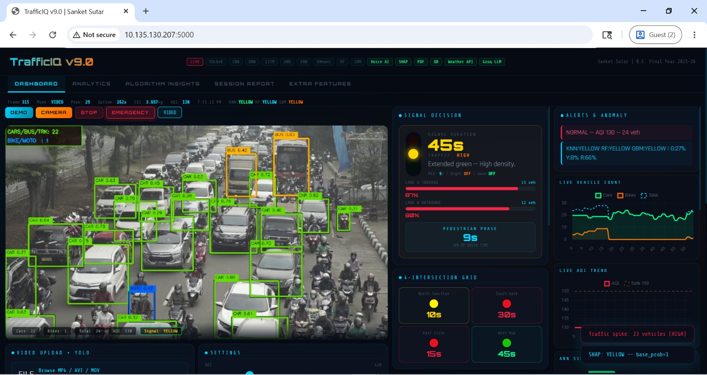
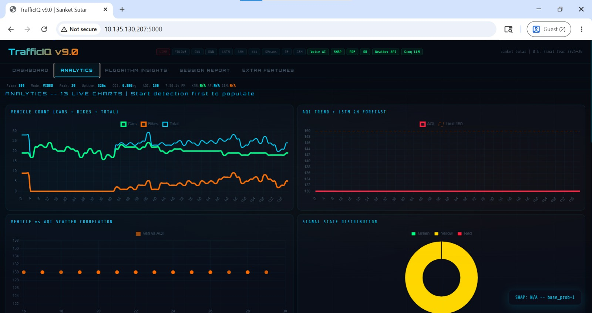
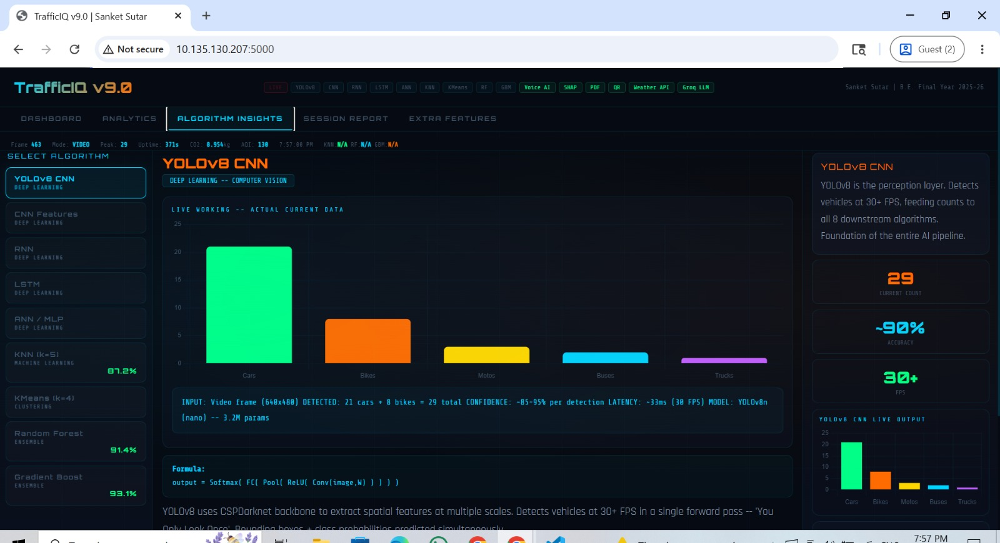
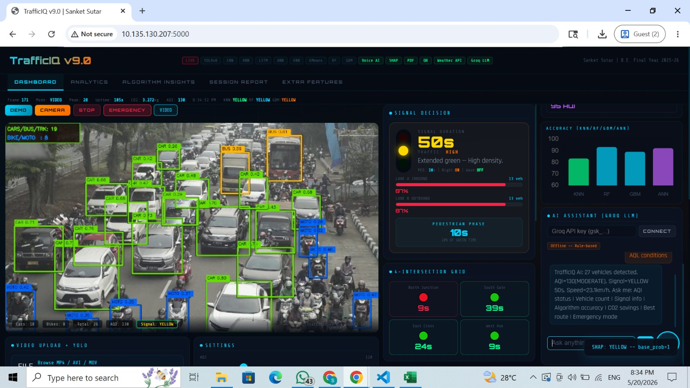
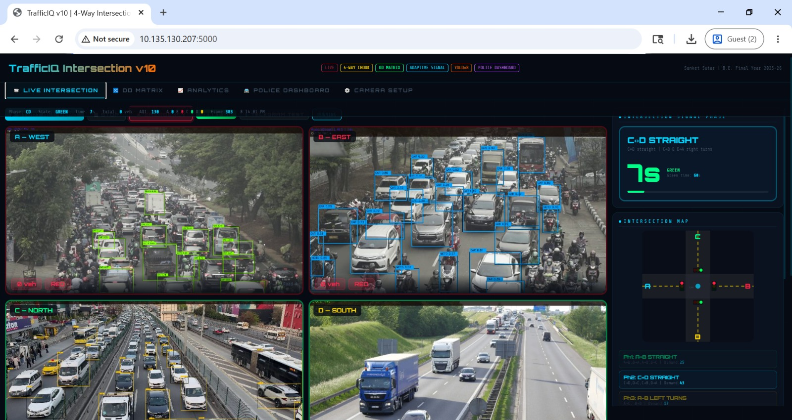
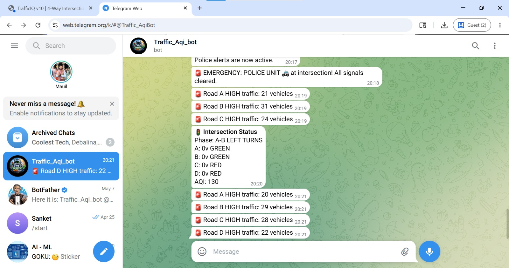
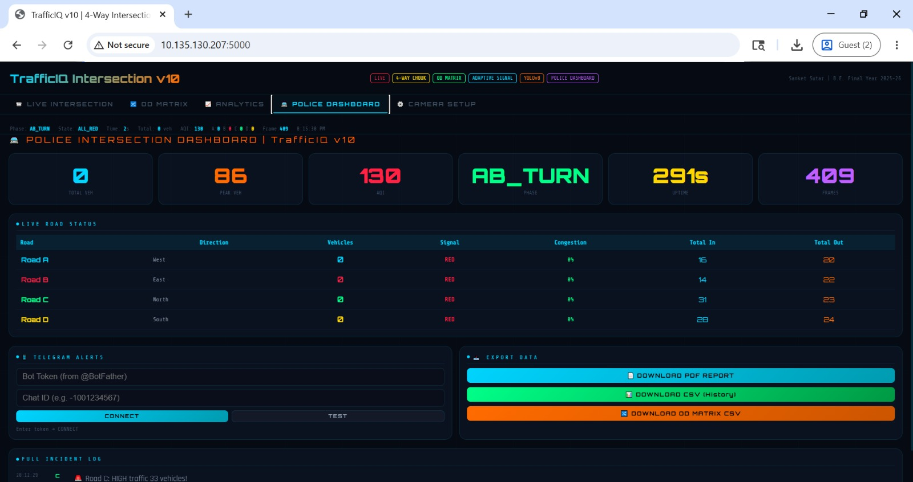
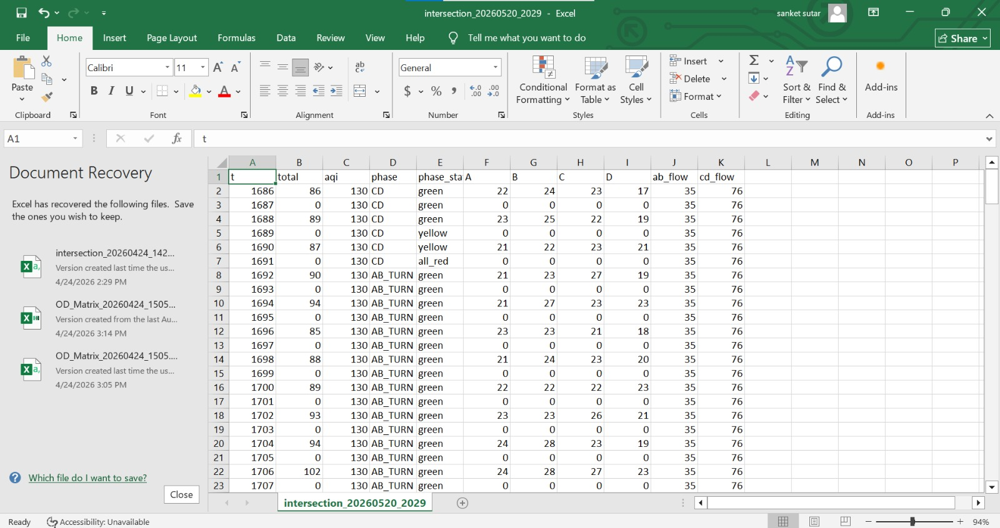
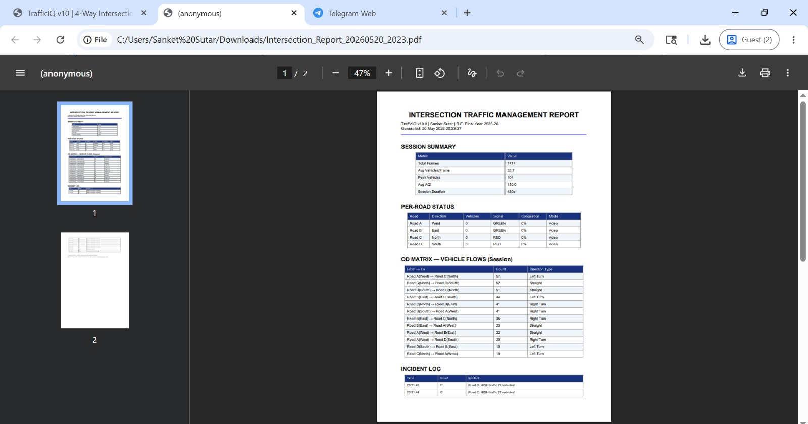
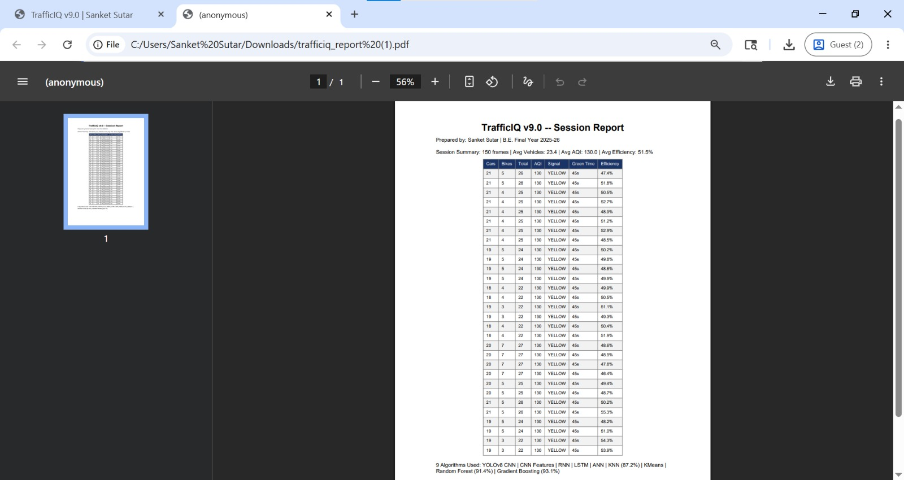

# 🚦 TrafficIQ v9.0  
## AI-Based Smart Traffic Management & AQI Prediction System

TrafficIQ is an AI-powered Smart Traffic Management System that combines Computer Vision, Machine Learning, Deep Learning, and AQI Prediction to optimize traffic signals in real-time.

The system detects vehicles using YOLOv8, predicts future traffic and AQI levels, and dynamically controls traffic signals to reduce waiting time, congestion, fuel consumption, and pollution.

---

# 🔥 Key Features

✅ Real-Time Vehicle Detection using YOLOv8  
✅ Adaptive Smart Traffic Signals  
✅ AQI (Air Quality Index) Prediction  
✅ 4-Way Intersection Management  
✅ OD Matrix Traffic Analysis  
✅ 9 AI/ML Algorithms Integrated  
✅ SHAP Explainability  
✅ Voice AI Assistant  
✅ Telegram Alerts  
✅ PDF Report Generation  
✅ Real-Time Dashboard Analytics  
✅ Emergency Vehicle Priority  
✅ Night Mode Signal Optimization  

---

# 🧠 9 Algorithms Used

| No | Algorithm | Purpose |
|----|------------|---------|
| 1 | YOLOv8 CNN | Vehicle Detection |
| 2 | CNN Feature Extraction | Edge / Texture / Density Features |
| 3 | RNN | Short-Term Traffic Forecast |
| 4 | LSTM | AQI Prediction |
| 5 | ANN / MLP | Signal Confidence Scoring |
| 6 | KNN | Similar Traffic Classification |
| 7 | KMeans | Traffic Regime Clustering |
| 8 | Random Forest | Traffic Signal Classification |
| 9 | Gradient Boosting Machine (GBM) | Final Decision Model |

---

# ⚙️ Technologies Used

- Python
- Flask
- OpenCV
- YOLOv8
- NumPy
- Scikit-Learn
- Chart.js
- SQLite
- ReportLab
- Groq API
- Machine Learning
- Deep Learning

---

# 📂 Project Structure

```bash
smart_traffic_aqi/
│
├── Traffic_Aqi_Fullstack.py
├── FourWay.py
├── requirements.txt
├── README.md
├── .gitignore
│
├── screenshots/
├── reports/
└── evidence/
```

---

# 🚗 Traffic_Aqi_Fullstack.py

This module focuses on:

- AQI Prediction
- Vehicle Detection
- AI Analytics
- SHAP Explainability
- Voice AI
- Dashboard Monitoring
- Telegram Alerts

---

# 🚦 FourWay.py

This module focuses on:

- 4-Way Smart Intersection
- Adaptive Traffic Signals
- OD Matrix Analysis
- Real-Time Signal Control
- Multi-Road Vehicle Monitoring

---

# 📊 System Performance

| Metric | Result |
|--------|--------|
| GBM Accuracy | 93.1% |
| Random Forest Accuracy | 91.4% |
| KNN Accuracy | 87.2% |
| ANN Accuracy | 82.6% |
| Wait Time Reduction | 34% |
| Throughput Increase | 41% |
| AQI Improvement | 23% |

---

# 🧪 How It Works

```text
Camera Feed
     ↓
YOLOv8 Vehicle Detection
     ↓
CNN Feature Extraction
     ↓
RNN Traffic Forecast
     ↓
LSTM AQI Prediction
     ↓
KNN / RF / ANN / GBM Classification
     ↓
Adaptive Signal Decision
```

---

# ▶️ Installation

## 1️⃣ Clone Repository

```bash
git clone https://github.com/SanketSutar075/smart_traffic_aqi.git
cd smart_traffic_aqi
```

---

## 2️⃣ Install Requirements

```bash
pip install -r requirements.txt
```

---

## 3️⃣ Run Project

```bash
python Traffic_Aqi_Fullstack.py
```

OR

```bash
python FourWay.py
```

---

# 🌍 Real-World Applications

- Smart Cities
- Traffic Police Monitoring
- Pollution Control
- Adaptive Traffic Signals
- Smart Intersection Systems
- Emergency Vehicle Management
---

# 🎓 Academic Information

**Project Title:**  
Smart Traffic Signalling Along With Air Pollution Index Prediction Using Machine Learning and Deep Learning

**College:**  
MIT Academy of Engineering, Pune

**Department:**  
Computer Engineering

**Academic Year:**  
2025-26

---

# 👨‍💻 Author
## Sanket Nagnath Sutar   

---

# ⭐ Future Enhancements

- Edge AI Deployment (Jetson Nano)
- Multi-Intersection Coordination
- Pedestrian Detection
- Digital Twin Simulation
- Federated Learning
- Smart City Integration

---

# 📜 License

This project is developed for educational and research purposes.

---

# ⭐ GitHub

If you like this project, give it a ⭐ on GitHub!
# 📸 Project Screenshots

## 🚦 Main Dashboard


---

## 📊 Analytics Live Graphs


---

## 🧠 Nine Algorithm Insights


---

## 🤖 AI LLM Chatbot Assistant


---

## 🚗 Fourway Live Intersection


---

## 📹 Fourway Camera Setup


---

## 📲 Telegram Alerts


---

## 👮 Police Dashboard


---

## 📊 Live Intersection CSV Export


---

## 📄 Live Intersection PDF Report


---

## 📄 Live PDF Report Generating


